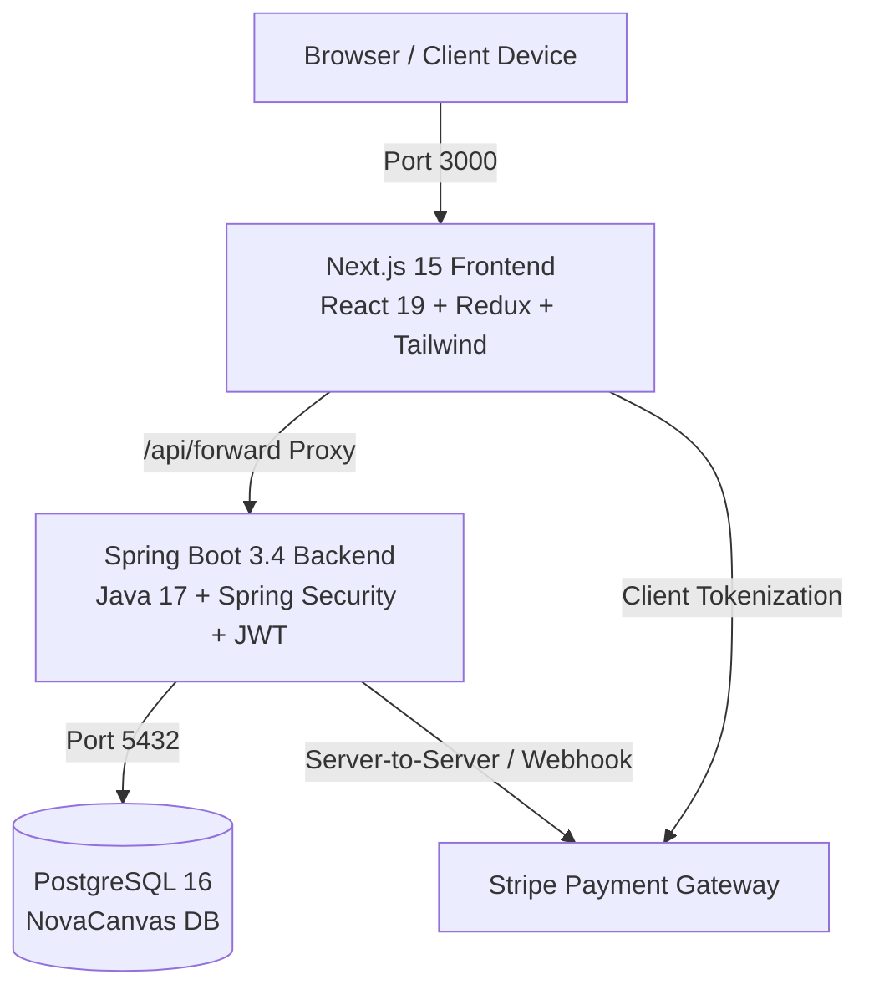

# NovaCanvas Studios™ — White-Label Fine Canvas E-Commerce Platform

[](https://nextjs.org/)
[](https://react.dev/)
[](https://spring.io/projects/spring-boot)
[](https://openjdk.org/)
[](https://www.postgresql.org/)
[](https://stripe.com/)
[](https://www.docker.com/)

**NovaCanvas Studios** is an enterprise-grade, turn-key "White-Label" E-Commerce platform purpose-built for American and global wall art sellers, Etsy top-sellers, fine art photographers, and canvas print studios.

Architected to be sold or licensed as a turnkey solution ($1,000+ target market value), this platform features **zero legacy vendor footprints**, pure **US Dollar ($) pricing**, a fully integrated **Stripe payment infrastructure** with interactive demo test card helpers, and a curated catalog of high-resolution canvas artworks.

---

## 🌟 Executive Showcase Highlights

- **100% White-Label & Global Rebranding:**
  - Complete elimination of regional legacy branding; establishing the sleek **NovaCanvas Studios** visual identity.
  - American commercial legal documentation: US Domestic Shipping (FedEx Ground 3-5 day & 2-Day Air), 30-Day Safe Arrival Guarantee, Delaware governing commercial terms, and CCPA/GDPR privacy compliance.
- **Modern Stripe Payment Ecosystem:**
  - Backed by the official **Stripe Java SDK v28** with server-side `PaymentIntent` confirmation and PCI-DSS Level 1 tokenization.
  - Seamless frontend card interface with live card type detection (Visa, Mastercard, Amex, Discover).
  - **1-Click Demo Sandbox Helper:** Built-in "Auto-Fill Test Card" button instantly loads Stripe's standard `4242` test details for rapid prospect evaluations.
  - Graceful sandbox demo fallback for offline or zero-configuration presentations.
- **Curated High-Resolution Canvas Catalog:**
  - 15 fine art panoramic canvas prints with 630 size & framing combinations ($49 to $189 USD).
  - 195 CDN-backed multi-angle webp images and room mockups.
  - 6 canvas sizes (`24"x8"`, `30"x10"`, `36"x12"`, `48"x16"`, `60"x20"`, `71"x24"`).
  - 7 framing options (Unframed Gallery Wrap, Matte Black, Classic White, Brass Gold, Brushed Silver, Walnut Espresso, Natural Oak).
- **Turnkey Ubuntu Server & Cloud Deployment:**
  - Automated single-command container orchestration: `docker compose up -d`.
  - Self-healing database initialization via `novacanvas_seed.sql`.
  - Optimized multi-stage Docker builds (Next.js standalone runtime ~150MB, Temurin 17 JRE Alpine ~160MB).

---

## 🏛 Architecture & Tech Stack



### Frontend
- **Framework:** Next.js 15.5 (App Router, Server Components & Client Actions)
- **UI Library:** React 19, Radix UI, Tailwind CSS, Lucide Icons, Shadcn components
- **State Management:** Redux Toolkit (Cart, Wishlist, Authentication, Categories)
- **Forms & Validation:** React Hook Form + Zod resolvers
- **Networking:** Server-side `/api/forward` proxy avoiding browser CORS restrictions

### Backend
- **Framework:** Java 17 LTS, Spring Boot 3.4.1
- **Security:** Spring Security 6, Stateless JWT Bearer Authentication, Bcrypt (strength 12)
- **Payments:** Official `com.stripe:stripe-java:28.3.0`
- **Persistence:** Spring Data JPA, Hibernate, PostgreSQL 16 Dialect

---

## 🚀 Single-Command Deployment (Ubuntu Home Server / VPS)

### 1. Prerequisites
Ensure Docker and Docker Compose are installed on your Ubuntu host:
```bash
sudo apt update
sudo apt install -y docker.io docker-compose-v2
sudo systemctl enable --now docker
```

### 2. Clone or Copy the Repository
```bash
cd /opt
git clone <repository_url> novacanvas
cd novacanvas
```

### 3. Configure Environment Variables (Optional)
The platform ships with working default configurations in `.env`. To customize Stripe keys or database credentials, edit `.env`:
```bash
cp .env.example .env
nano .env
```
*(Leave `STRIPE_API_KEY` blank to run in automatic Sandbox Mock mode during presentations!)*

### 4. Start the Application Stack
Execute the single deployment command:
```bash
docker compose up -d --build
```

### 5. Access the Platform
Once running, the services are available at:
- **Storefront & Customer Checkout:** `http://<your-server-ip>:3000`
- **Admin Dashboard:** `http://<your-server-ip>:3000/admin`
- **Spring Boot REST API:** `http://<your-server-ip>:8080`
- **PostgreSQL Database:** `localhost:5432`

---

## 🔑 Pre-Seeded Showcase Credentials

The automated database initialization script (`novacanvas_seed.sql`) pre-loads the following demo accounts:

| Role | Email | Password | Access Rights |
| :--- | :--- | :--- | :--- |
| **Platform Admin** | `admin@novacanvas.com` | `Admin123!` | Full catalog, orders, shipping, payment logs & analytics |
| **Customer Demo** | `sarah.jenkins@example.com` | `Customer123!` | Orders history, cart, wishlist, checkout |

---

## 💳 Stripe Checkout & Demo Mode Walkthrough

1. Navigate to the storefront (`http://<your-server-ip>:3000`).
2. Select any fine art piece (e.g., *Ethereal Whispers* or *Golden Aurora Nuance*).
3. Choose your preferred size (`36" x 12"`) and floating frame (`Natural Oak Float Frame` or `Modern Brass Gold`).
4. Click **Add to Cart** or **Buy Now** and proceed to **Checkout**.
5. On the checkout page:
   - Notice the **"Live Showcase Sandbox Card"** banner.
   - Click **"Auto-Fill Test Card"** to instantly inject the standard Stripe test card (`4242 •••• •••• 4242 | 12/28 | 123`).
   - Click **"Complete Order"**.
6. The transaction is authorized via Stripe PaymentIntent, the cart is automatically cleared, and you are directed to the live order confirmation screen (`/orders/{orderId}`).
7. In the Admin Dashboard (`/admin/payments`), inspect the full transaction log showing the Stripe Payment ID, authorization timestamp, and fraud-check clearance.

---

## 🌐 Public Access & Production Reverse Proxy

### Option A: Cloudflare Tunnel (Zero Port-Forwarding, Recommended)
Run a secure, encrypted HTTPS tunnel to expose the frontend to potential US buyers:
```bash
cloudflared tunnel --url http://localhost:3000
```
This gives you an instant `https://your-studio.trycloudflare.com` URL to share with prospects.

### Option B: Nginx Reverse Proxy with Let's Encrypt SSL
Create `/etc/nginx/sites-available/novacanvas`:
```nginx
server {
    listen 80;
    server_name gallery.yourdomain.com;

    location / {
        proxy_pass http://127.0.0.1:3000;
        proxy_http_version 1.1;
        proxy_set_header Upgrade $http_upgrade;
        proxy_set_header Connection 'upgrade';
        proxy_set_header Host $host;
        proxy_cache_bypass $http_upgrade;
    }
}
```
Enable and secure with SSL:
```bash
sudo ln -s /etc/nginx/sites-available/novacanvas /etc/nginx/sites-enabled/
sudo certbot --nginx -d gallery.yourdomain.com
```

---

## 🎨 Rebranding for New Clients (White-Label Quick Guide)

To license or sell this platform to a new boutique:
1. **Brand Name & Titles:** Search and replace `NovaCanvas Studios` in `src/app/layout.tsx`, `Header.tsx`, `Footer.tsx`.
2. **Contact & Legal:** Update `concierge@novacanvas.com` in `contact/page.tsx`, `privacy-policy/page.tsx`, `terms-and-conditions/page.tsx`.
3. **Color Theme:** Customize primary accent colors in `src/app/globals.css` and `tailwind.config.ts`.
4. **Catalog:** Modify `novacanvas_seed.sql` with the client's custom artwork images and pricing tiers.

---

## 📄 License & Commercial Rights
Designed and engineered for white-label licensing and commercial acquisition.  
© 2025 NovaCanvas Studios. All rights reserved.
